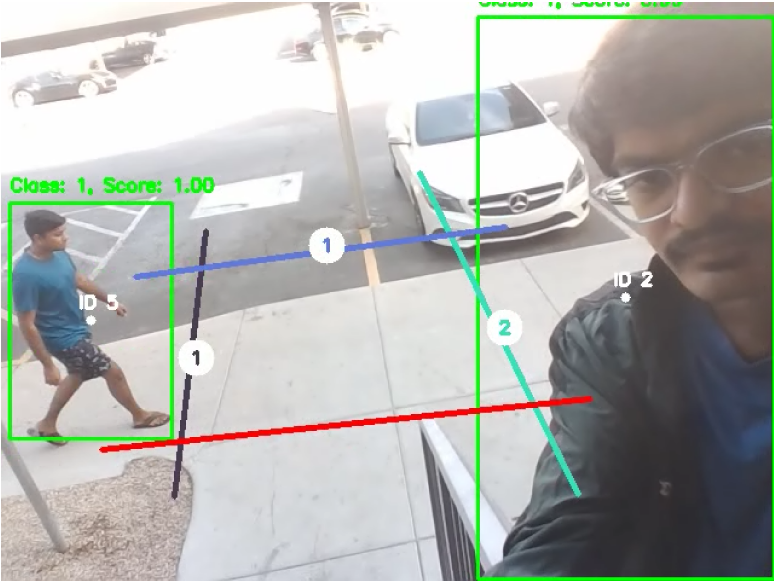
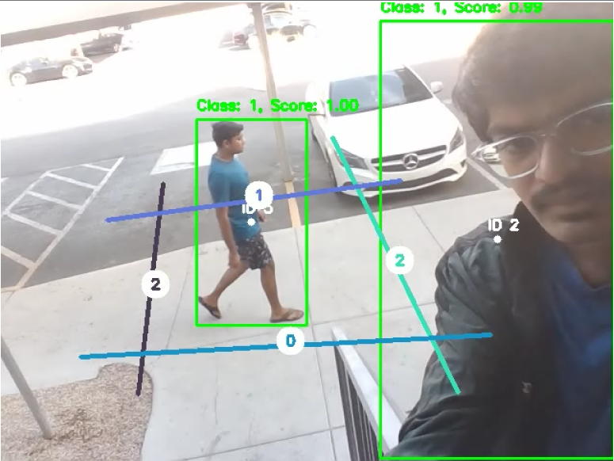

# User-Defined Object Counting Video Tool

Combined FasterRCNN for object detection and Centroid Tracking algorithms, with a Line-Segment drawing tool to count objects passing through the user-drawn lines on the video. OOP used here allows users to draw multiple line-segment counters on the video.

## Installation and Usage

Run **app.py** to run the project on your laptop camera feed.

Use [pip](https://pip.pypa.io/en/stable/) to install requirements for the project.

```bash
pip install requirements.txt
```


## Demonstration


## Code Explanation

| **Initial Count and Inserting Counter**  | **Updated Count and New Counter** |
| :-------------: |:-------------:|
|       |      |

**LineSegmentCounter** : It allows user to draw line segments on the video. It also displays the count of the objects passed through the line segments.

1) **draw_stored_segment** : It’s the main method that needs to be run for drawing and displaying the line segment counters on the frame. Using the center information of the objects in the current frame and previous frame, it detects whether the object has passed through the line segment or not.
2) **mouse_event** : It detects the mouse click, draws a temporary line segment, registers new line segment once the mouse button is released and assigns a color to it.
3) **draw_text_on_segments** : It updates the counter and writes count on the line segment.
do_intersect: It takes 2 line segments co-ordinates as an input and returns True if they intersect.

**ObjectDetector** : Used for detecting object using FasterRCNN_resnet50
1) **detect_objects** : It detects objects with confidence threshold>0.7 and draws the bounding box around the object in the frame. It also returns the center of the bounding boxes which can be used for tracking the detected objects.

**CentroidTracker** : It tracks the detected objects using the center information from previous frame and current frame. 
1) **register_objects**: If the new detection is far from the threshold distance then register it as new object or else it is the same object. It also updates the center information of the objects.
2) **cleanup_unused_objects** : Sometimes object detection gets missed for few frames, so if the detection again appears after few frame and it is within the threshold distance it registers it as the same object. If the detection is missed for more than few frames then the object information is deleted.
